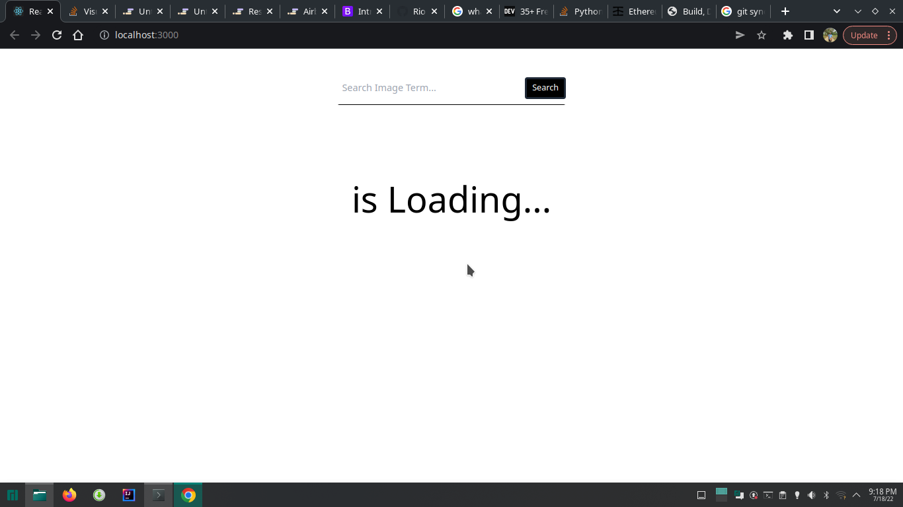
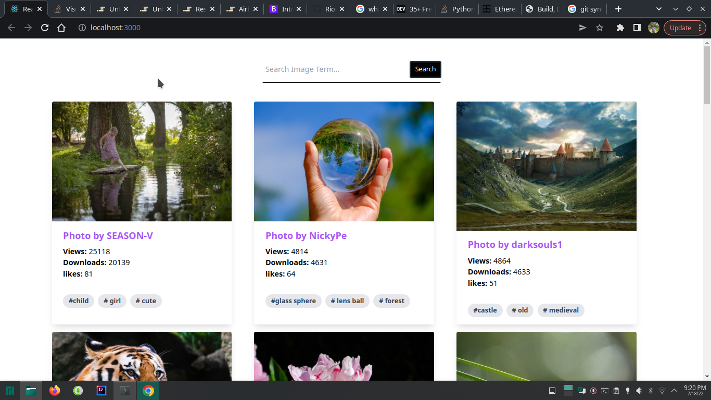
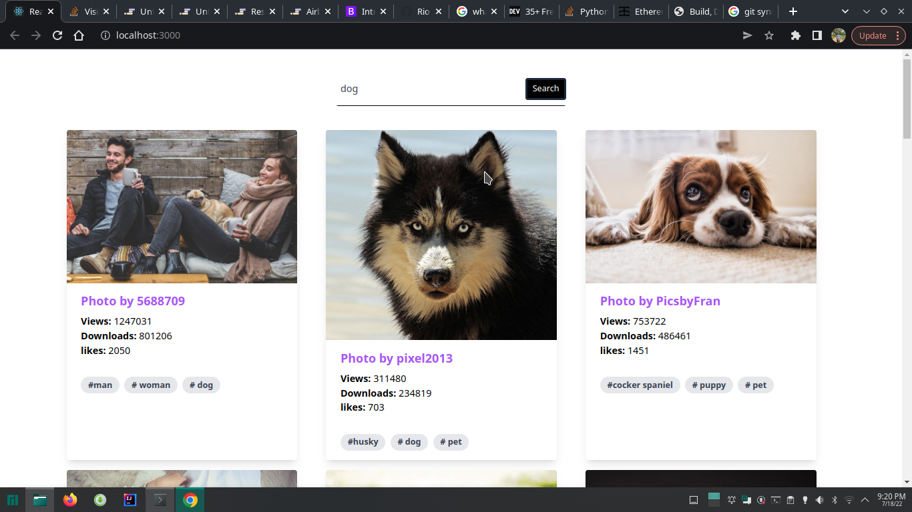
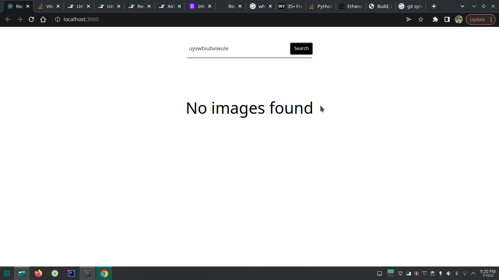

# Retrieving pictures from pixabay and react app

Our application retrieves data (images, stats, tags) of images from the pixabay API and displays them. 

The features of the app include

* Searching for specific images 
* Tagging photos based on a certain category
* Displaying statistics for a particular image

## Preview of the application

1. when it is loading

2. When loaded 

3. Searching for image

4. When there is no result for image

# React and tailwind

This project uses the create react app 

``
npx create-react-app project-name
``

We have used tailwind for the frontend development.

## Credits and acknowledgment

This is a project which I tried as much to learn from Travesy Media youtube channel. I have done changes in the UI abit and also for the current date, react and tailwind have default configurations. 